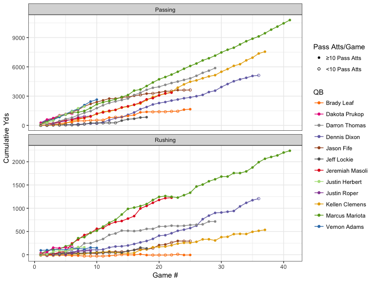
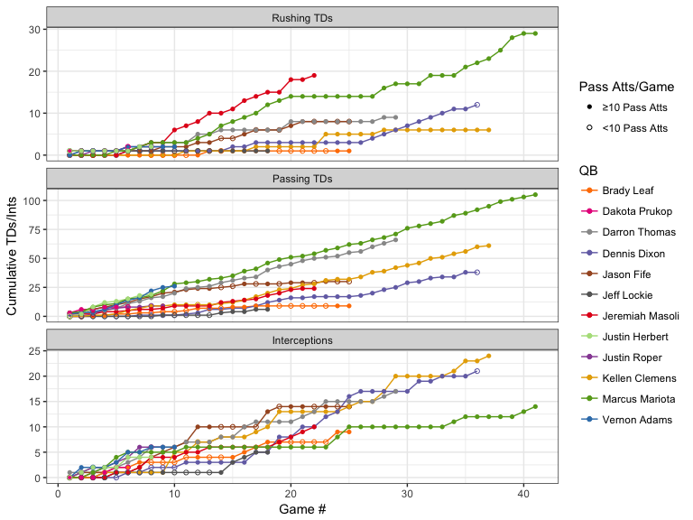
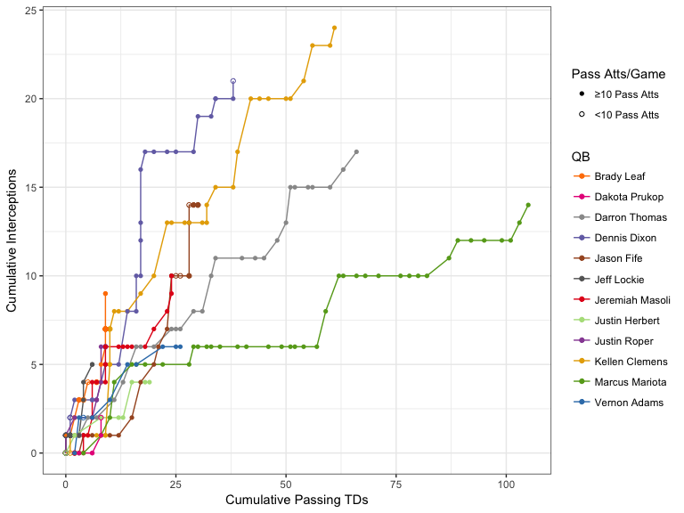
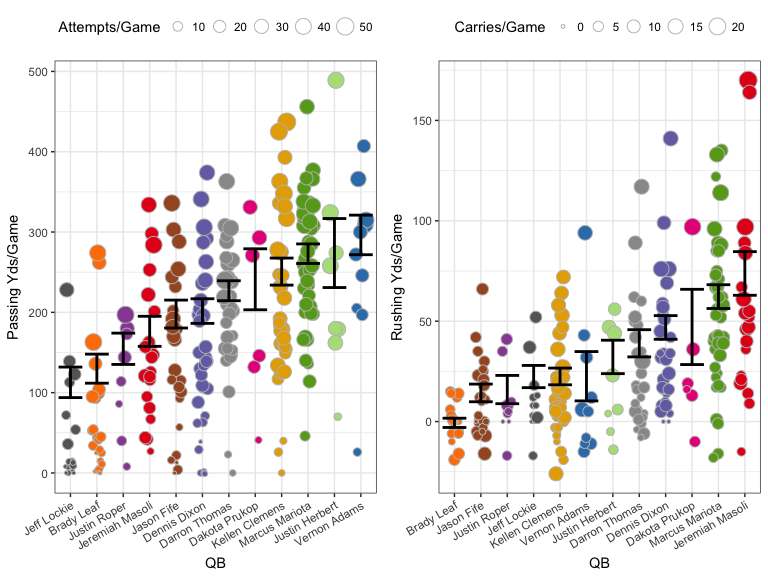
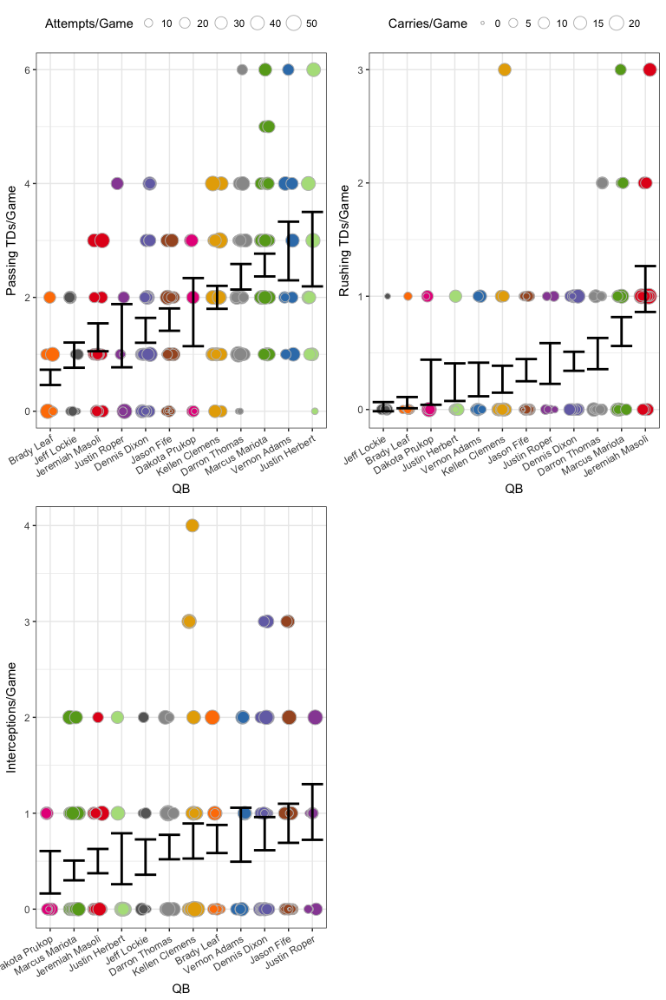
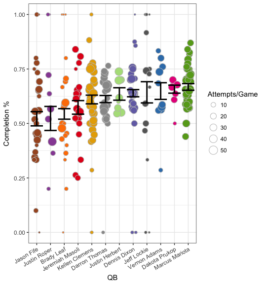
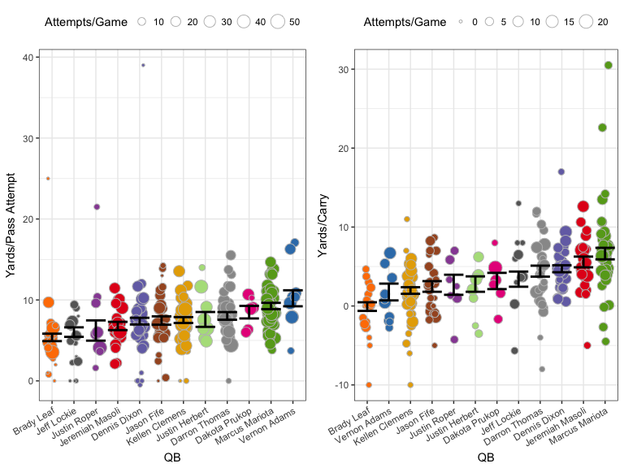

# Oregon Ducks QB career stats from 2002 to 2016

The 2016-17 was a bummer, but stats are fun. (Right? I'm not the only who thinks that?) So I decided to take a look back over the program as far as I could. I was basically only limited by how readily available these stats were available online, which let me go back to 2002 (earliest game data available on ESPN). Despite that, starting in 2002 seems like a reasonable window to make comparisons between players without running into issues of major differences in football rules or player training practices.

The first thing I wanted to do was get an idea of what each quarterback had done over the course of their entire career by looking at their cumulative stats. I then go on to look at stats on a per game and per attempt/carry basis. I excluded any QB that had fewer than 100 pass attempts. This was mostly for visualization reasons, as too many QBs made it hard to see what was going on, plus it excluded many QBs that probably weren't that interesting to compare in the first place. I have the data, though, should you be interested.

## Cumulative Stats

__Passing and Rushing Yards__

Cumulative stats can be hard to compare because each QB played a different number of games, but it's a good first step to get an idea of what each player did over the course of his career. The figure below show cumulative passing (top) and rushing (bottom) yards for the twelve QBs covered in this analysis. Solid circles indicate games in which the QB made at least 10 pass attempts, open circles are games in which he made fewer than 10. Like the 100 total pass attempts above, this was a rather arbitrary cutoff, but at least to my eye, it seemed to line up pretty well with whether or not that QB had the majority of reps for the game. 

<!-- -->

Obviously, Mariota's line (medium green) stands out, both because of his total passing and rushing yards, but also because he played the most games for Oregon over the course of his career. Furthermore, other QBs had similar rates of passing yards later in their careers (Thomas, Clemens, Dixon), but because their early production was so much lower than Mariota's they just can't catch up. A last note on cumulative passing yards, Adams looked on track to beat Mariota, even with his injuries, but, alas, we only had him for a year (and of course he wasn't starting as a red-shirt freshman). 

Where Mariota really stands out is in cumulative rushing yards. The only QB that keeps pace with Mariota is Masoli, but as you might recall, his career at Oregon was cut short by some poor decisions. Darron Thomas has an interesting trajectory, gaining rushing yards pretty quickly through his first 14 games and then going to a much slower rate.

__TDs & Interceptions__

The next figure show the accumulation of rushing TDs, passing TDs, and interceptions for each QB. 

<!-- -->

Mariota may have accumulated a very similar number of rushing yards as Masoli over a similar number of games (previous figure), but Masoli was clearly on pace to have the most rushing TDs of any Oregon QB. Also, that stretch from game 20 to 27 in which Mariota didn't score a single rushing TD was the second half of the 2013-2014 season (his 20th game was against WSU) to the first game of the 2014 season (against Michigan State).

Lastly for cumulative stats, we see just how few interceptions Mariota accumulated over the course of his career, especially compared to the other QBs who amassed decent passing yards and TDs like Clemens, Dixon, and Thomas. This is further highlighted by the following graph, which plots cumulative passing TDs vs cumulative interceptions.

<!-- -->

## Per Game Stats

As I mentioned above, it's hard to compare cumulative stats between QBs when you have such a variation in how many total games they played. So, let's look at their production on a per game basis. All the following figures will have the same following attributes:

- QB name will be on the x-axis (colors will match what was used above)
- Each point represents the given stat for a single game
- A point's size is relative to the total number of attempts or carries for that game
- The black set of error bar represents the stand error around the mean for all games combined. _Importantly, games with more attempts were given greater weight in order to downweight games in which a QB only had a few attempts._

__Passing and Rushing Yards__

The following figures show the passing and rushing yards per game for each QB. If you were to calculate a regression line for the cumulative yards graphs above, the slope of that line should roughly correspond to the mean presented here (roughly because of the aforementioned weighting by attempts/carries).

<!-- -->

Maybe a little surprising is that Mariota is not top dog on either graph here. Both Adams and (encouragingly) Herbert, have slightly higher passing yards per game than Mariota, though I didn't do the stats to determine if they're significantly higher. Herbert, in particular, has quite a variation given the small number of games he's played, but maybe that should be expected from a true freshman in his first year. Only time will tell.

Of course, only Masoli had more rushing yards per game, on average, than Mariota, and Herbert is right in the middle of the pack. We'll see if that changes with Taggart's offense.

__TDs & Interceptions__

As before, we move onto passing and rushing TDs and interceptions per game. 

<!-- -->

Again, somewhat encouraging for our current situation, Herbert is up there with Mariota and Adams. Masoli is the run king, and Prukop threw fewer interceptions than I remember (though these stats are not good for showing the impact of those interceptions on a game).

__Completion percentage__

Here we have a stat that doesn't have a cumulative counterpart: completion percentage for each game.

<!-- -->

Hey look, Mariota is back on top. Most surprisingly, Prukop and Lockie were much higher than I expected. Again, I didn't do proper stats, but a good rule of thumb is if the standard error intervals don't overlap there's probably a statistically significant difference. That puts Herbert, Dixon, Lockie, Adams, Prukop, and Mariota all at similar completion percentages per game. Huh.

## Per Attempt Stats

__Passing and Rushing Yards__

The figure below shows the average yards gained _per attempt_ in each game for each QB. So, each point still represents a single game, as in the figures above. Again, the error bars were calculated by giving greater weight to games with more attempts/carries.

<!-- -->

These stats are not too surprising. Herbert is right in the middle of the pack for both stats, so it will be interesting to see if that changes much through the course of this year. We see that Mariota averaged more than 5 yards per carry, which is quite impressive, and Vernon Adams averaged right around 10 yards per pass attempt, which is really just astounding to me. This, along with all the previous stats really highlights what many already knew, that Adams and Masoli are basically opposites in terms of QB style, and Mariota did really have it all.

So that's it for the 2002-2016 Oregon quarterbacks. I will do my best to update this in a timely matter by the end of the upcoming season. Sco' Ducks!
