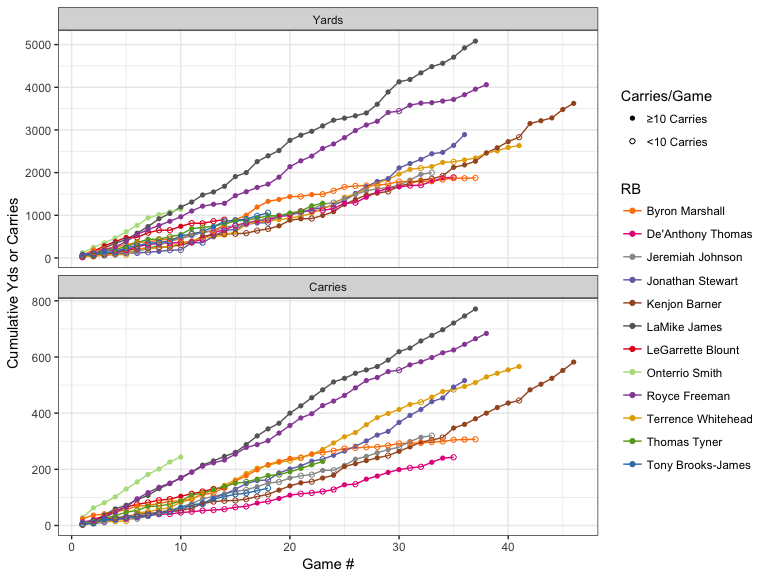
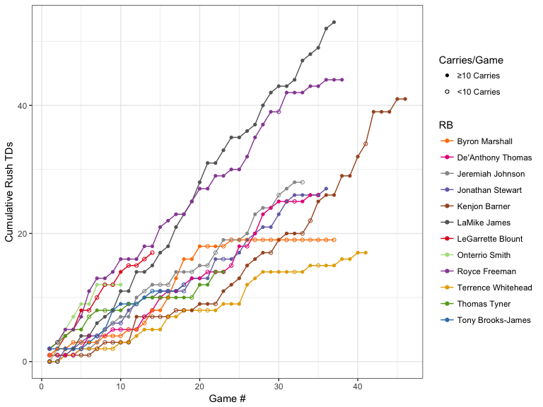
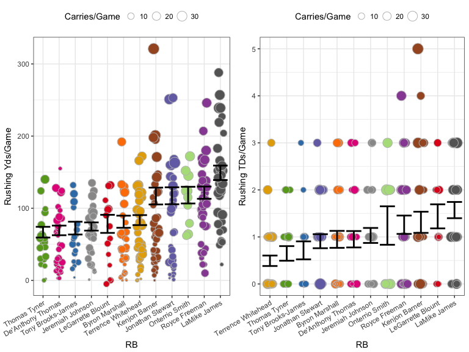
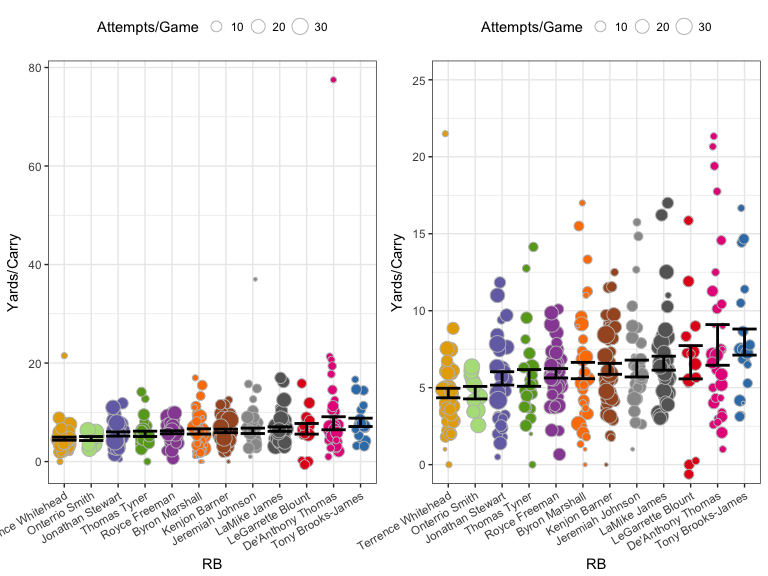

# Oregon Ducks RB career stats from 2002 to 2016

This analysis looks at Oregon running backs from 2002 to 2016, just as I did for quarterback. The following analysis follows a very similar structure.

## Cumulative Stats

__Rushing Yards and Carries__

As I mentioned in the QB post, cumulative stats can be hard to compare because each RB played a different number of games, but it's a good first step to get an idea of what each player did over the course of his career. The figure below show cumulative rushing yards (top) and carries (bottom) for the twelve RBs covered in this analysis. Solid circles indicate games in which the RB had at least 10 carries, open circles are games in which he had fewer than 10.

<!-- -->

In terms of both total yards and total carries, the two that stand out are LaMichael James and Royce Freeman. No big surprise there. Kenjon Barner sticking around for another year got him over the 3,000 yards mark.

__TDs__

The next figure show the accumulation of rushing TDs for each RB. 

<!-- -->

Again, James and Freeman really stand out from the pack, with Kenjon Barner pulling ahead of the lower tier group due to his longevity. Byron Marshall's line flat lines as he started getting used more as a receiver than a runner.

## Per Game Stats

As I mentioned above, it's hard to compare cumulative stats between RBs when you have such a variation in how many total games they played. So, let's look at their production on a per game basis. All the following figures will have the same following attributes:

- RB name will be on the x-axis (colors will match what was used above)
- Each point represents the given stat for a single game
- A point's size is relative to the total number of carries for that game
- The black set of error bar represents the stand error around the mean for all games combined. _Importantly, games with more carries were given greater weight in order to downweight games in which an RB only had a few carries._

__Rushing Yards & TDs__

The following figures show the rushing yards and touchdowns per game for each RB. If you were to calculate a regression line for the cumulative graphs above, the slope of that line should roughly correspond to the mean presented here (roughly because of the aforementioned weighting by carries).

<!-- -->

I think this the left side of the graph above is the most telling so far because the weighting of the games by carries allows us to ignore games the RBs didn't pay much in. As I mentioned in the QB post, while I didn't run proper stats here, a good rule of thumb is that if the standard error intervals (the black error bars here) don't overlap, there's a good chance there's a statistically significant difference in the means. Thus, based on yards per game, we see three tiers of running backs at Oregon in this time frame:

- _Tier 1_: LaMichael James rushing for nearly 150 yards per game.
- _Tier 2_: Freeman, Smith, Stewart, & Barner, who rushed for over 100 per game
- _Tier 3_: The rest, who did not average over 100 yards a game, but did have 100+ individual games. Tony Brooks-James has an opportunity this year to up his average.

Looking at the touchdowns per game, the tiers aren't nearly so obvious. Part of that is simply that it's very rare for a running back to get more than three TDs in a a game (that 5 TD outlier from Barner was in the 2012 game against USC that we won 62-51). To my eye, the biggest discrepancy between yards per game and TDs per game is LeGarrette Blount, who goes from 8th to 2nd on this list. 

## Per Attempt Stats

__Rushing Yards__

The figure below shows the average yards gained _per carry_ in each game for each RB. So, each point still represents a single game, as in the figures above. Again, the error bars were calculated by giving greater weight to games with more attempts/carries.

<!-- -->

These two graphs show the same data, however those two major outliers (Thomas's 155 yards on 2 carries in the 2012 Rose Bowl game against Wisconsin and Johnson's game against Utah State in which he had 1 carry for 37 yards) make looking at the data difficult, so the right panel just excludes those points.

This is the only stat so far where James is not on top, though there's not much separation between him and the RBs above him. Thomas and Blount (the two most different RBs?) have a pretty large variance, but probably for very different reasons. Tony Brooks-James is the leader here and is looking to get significant carries, albeit behind Freeman. Let's hope he continues this trend.

So that's it for the 2002-2016 Oregon running backs. I will do my best to update this in a timely matter by the end of the upcoming season. Sco' Ducks!
